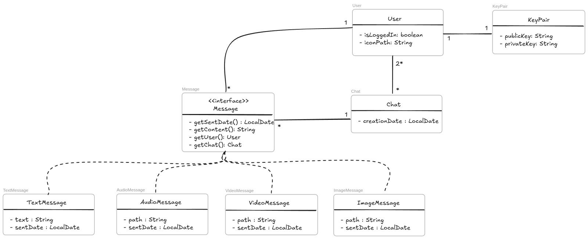

# Burner Chat, por Secure Development in Kotlin

**Burner Chat** es una aplicación de mensajería anónima instantánea que utiliza el protocolo WebRTC para el envío de datos Peer-To-Peer. La aplicación constará de una interfaz de usuario similar a Whatsapp y los datos y mensajes recabados estarán ubicados en el dispositivo del usuario, de forma que si se borra la aplicación o se cambia de dispositivo todos los datos se perderán para siempre.

No será necesario un número de teléfono, sino que se generará un nombre de usuario con un par de claves para poder añadir contactos y dichas claves únicamente se almacenarán en el dispositivo del usuario.

    
    

## Diagrama del modelo de datos

## Cómo configurar los servidores

- Revisar [Documentación](https://github.com/Secure-Development-in-Kotlin/Burner-Chat/blob/gitblanc/documentation/Configure%20server.md)
